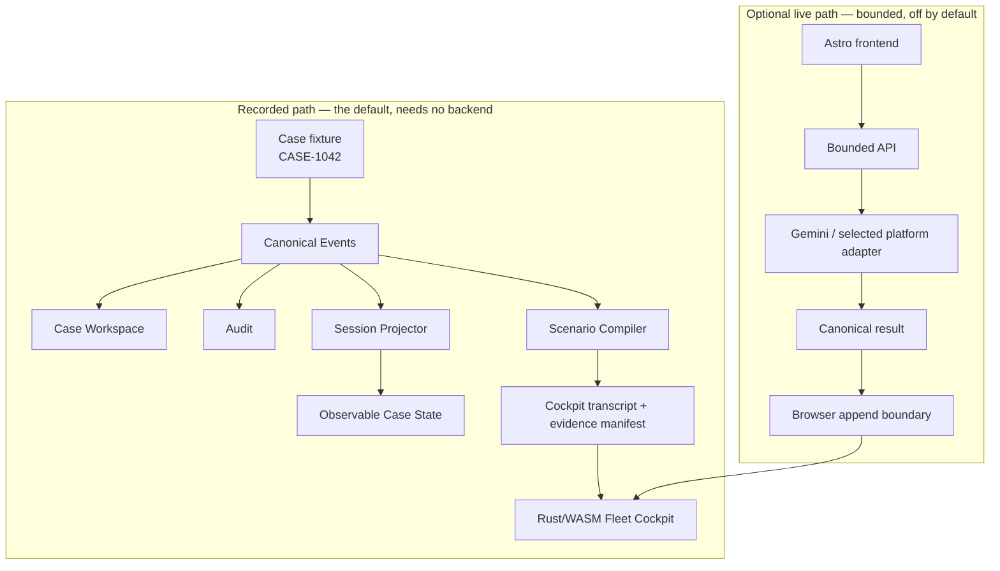

# FleetScope

FleetScope is an enterprise agent-fleet control plane. A procurement manager
discovers an approved, versioned agent in the **Agent Catalog**, starts a durable
multi-week **Case**, and returns days later without losing context. Registry,
Runtime, Memory Bank, Identity, Gateway, Model Armor, and Observability decisions
are captured as append-only **Canonical Events**, projected deterministically into
**Observable Case State**, and surfaced across a Case Workspace, an Approval
Inbox, an expert **Fleet Cockpit**, and an **Audit** view — so every badge the UI
shows is backed by recorded evidence rather than an assumption. FleetScope is not
merely a graph viewer, and the Cockpit is one surface within it, not the product.

## Architecture



The default, demo, and public path requires **zero backend availability**: the
static build inlines recorded evidence, so the product works with the network
disabled after first load.

## Repository map

| Path                         | What it is                                                                               |
| ---------------------------- | ---------------------------------------------------------------------------------------- |
| `apps/web`                   | Astro product shell (static output). Catalog, Cases, Approvals, Cockpit mount, Audit.    |
| `apps/api`                   | One small Hono service: `/health`, `/capability`, one bounded live proof. Optional.      |
| `packages/domain`            | The FleetScope vocabulary. Framework-independent.                                        |
| `packages/event-schema`      | Canonical Event envelope, the closed event-type set, JSONL codec, generated JSON Schema. |
| `packages/projector`         | The versioned **pure** Session Projector and the state-hash contract.                    |
| `packages/fixtures`          | Recorded Case evidence — a product asset, not a test leftover.                           |
| `packages/scenario-compiler` | Canonical Events → Cockpit transcript, behind a `RendererAdapter` seam.                  |
| `packages/platform-adapters` | The seven platform adapter interfaces with explicit `recorded / synthetic / live` modes. |
| `packages/shared`            | Canonical JSON, SHA-256, `Result`, central config parsing, the live-mode guard.          |
| `crates/fleet-cockpit`       | Rust: transcript model, Event Cursor, browser ABI (`fleetscope_*`).                      |
| `vendor/`                    | Reserved for the pinned upstream WASM renderer. **Empty** — see `vendor/README.md`.      |
| `docs/`                      | Product, requirements, design, plans, decisions, `architecture.md`.                      |
| `scripts/`                   | `typecheck.sh`, `build-wasm.sh`, `smoke.sh`, `bless-fixtures.ts`.                        |

Dependency rules and per-package responsibilities: **`docs/architecture.md`**.

## Prerequisites

| Tool                     | Version                           | Notes                                                        |
| ------------------------ | --------------------------------- | ------------------------------------------------------------ |
| Node                     | **22.x** (verified on 22.18.0)    | `engines` requires `>=22`.                                   |
| pnpm                     | **11.x** (verified on 11.24.0)    | `corepack enable` installs the pinned version.               |
| Rust / Cargo             | **1.90.0** verified, 1.82 minimum | `rust-toolchain.toml` pins stable + rustfmt + clippy.        |
| `wasm32-unknown-unknown` | —                                 | `rustup target add wasm32-unknown-unknown`                   |
| `trunk`                  | latest                            | **Not installed by default.** `cargo install --locked trunk` |

Only `trunk` is optional: everything except the bundled WASM artifact builds and
tests without it.

## Local setup

```bash
git clone <repo> && cd FleetScope
corepack enable
pnpm install

cp .env.example .env          # optional; every default is already safe

pnpm dev                      # Astro at http://localhost:4321 → /cases
```

That is the whole setup for normal development. No cloud project, no credential,
and no model call is involved.

Other entry points:

```bash
pnpm dev:web                  # Astro only
pnpm dev:api                  # bounded API on :8080 (optional)

pnpm build                    # static site
pnpm build:web
pnpm build:wasm               # requires trunk

pnpm scenario:compile CASE-1042   # canonical events → Cockpit transcript
pnpm fixtures:bless               # regenerate blessed replay hashes
pnpm schema:emit                  # regenerate JSON Schema from Zod

pnpm check                    # format + lint + typecheck + test + build
pnpm smoke                    # the above plus the full Rust/WASM toolchain
```

## Recorded mode

`LIVE_MODE=false` is the default and the **safe** default. It fails closed: only
the literal string `"true"` enables live mode, so a typo or an unset variable both
mean recorded-only.

In recorded mode:

- `apps/web` renders entirely from `packages/fixtures` inlined at build time;
- the projector reads canonical events and computes state and hashes locally;
- `apps/api` is not required at all, and if it is running it refuses every live
  request with `409 live_mode_disabled` and names the recorded fallback.

Every surface labels its execution mode — _Recorded Case_, _Live proof_,
_Synthetic system_, _Simulated day boundary_ — so recorded evidence can never be
mistaken for a live platform result.

## Live mode

Optional, bounded, and off unless deliberately enabled. Turning it on requires
`LIVE_MODE=true` **plus** `GEMINI_MODEL` and `GCP_PROJECT_ID`; the service refuses
to boot otherwise.

Guardrails, all enforced in code:

- only allowlisted `(caseId, stepId)` pairs are accepted — **there is no
  free-form prompt endpoint anywhere in the service**;
- at most `GEMINI_MAX_CALLS_PER_CASE` (default 2) model calls per Case;
- 2,000 input / 300 output tokens, temperature 0, 15 s timeout by default;
- Cloud Run runs `min-instances=0`, `max-instances=1`, with no worker.

The Gemini call itself is **not implemented yet**: with live mode on, an
allowlisted step returns `501 not_implemented` rather than a fabricated result.
See `docs/decisions/0003-bounded-live-path.md`.

Never boot the normal UI with credentials. It does not need them.

## Testing

```bash
pnpm test                     # all TypeScript tests
pnpm test:unit                # domain, schema, config, compiler, api guards
pnpm test:replay              # projector determinism + CASE-1042 fixture proofs
pnpm typecheck                # every package + astro check
pnpm lint
pnpm format:check

cargo test
cargo fmt --all -- --check
cargo clippy --all-targets -- -D warnings
cargo build --target wasm32-unknown-unknown -p fleet-cockpit

pnpm smoke                    # everything above, with explicit PASS/FAIL/SKIP
```

`pnpm test:replay` is the load-bearing one: it proves that the same canonical
prefix and projector version yield the same Observable Case State hash, and that
the fixture upholds the product invariants (blocked input never used downstream,
intervention states never collapsed, every badge traceable to an event).

## Licensing

FleetScope is MIT licensed — see `LICENSE`.

Third-party attribution lives in **`THIRD-PARTY-NOTICES.md`**, and only there:
per product decision D8, notices stay in repository licensing files and do not
appear in product navigation. `vendor/` is currently empty; the fork and
attribution procedure for the planned upstream WASM renderer is written down in
`vendor/README.md` and must be completed in the same commit that introduces it.
