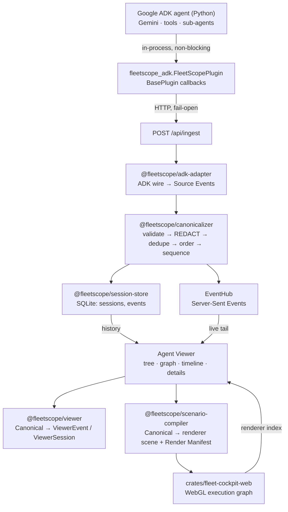

# Architecture

How a Google ADK run becomes a graph you can scrub.

## The one-line version

```
ADK callbacks → Source Events → Canonical Events (REDACTED) → SQLite + SSE → ViewerEvents → graph, timeline, details
```

## The full path



The browser holds the canonical stream. That is what makes historical inspection
free: every projection — timeline rows, agent tree, session summary, renderer
scene — is a pure function of a **prefix** of that stream, so moving backwards is
re-derivation, never a request and never an execution.

## The two event models

FleetScope has a rich internal vocabulary and a small developer-facing one. They
are not in competition; the second is a projection of the first.

### Canonical Events — internal, authoritative

`packages/event-schema` defines a closed set of 45 types across 15 families
(`runtime.*`, `agent.*`, `model.*`, `tool.*`, plus the deferred governance
families). A Canonical Event is immutable, schema-versioned, redacted, sequenced,
and the only input to any projection.

```ts
{
  eventId, caseId, caseSequence, sessionId, sessionSequence,
  schemaVersion, type, sourceTime, ingestionTime?, acceptedTime,
  actor, correlations, payloadRedacted, payloadDigest?
}
```

The local Agent Viewer uses ten of those types. The other 35 belong to the
deferred enterprise direction and cost nothing to keep: they are table entries,
not code paths.

### ViewerEvents — what the browser reads

`packages/viewer` projects the canonical stream onto eleven types:

```
session.started · session.completed
agent.started   · agent.completed · agent.handoff
model.started   · model.completed
tool.started    · tool.completed  · tool.failed
error
```

A developer never has to learn the word *Canonicalizer*, *Projector* or *Render
Manifest* to use the product. Those are how it is built, not what it is.

`agent.handoff` has no canonical type of its own: it IS an `agent.spawned` that
names a parent. That is deliberate — a delegation is a fact about parentage, and
inventing a separate event for it would create two sources of truth for the tree.

## The rules the code enforces

### 1. Redaction happens before persistence

`canonicalizeAppend` redacts inside the Collector, before the first write and
before the first byte reaches a browser. Two independent classifiers run over
every payload leaf: by **field name** (`api_key`, `authorization`, `password`,
`prompt`, `thinking`, …) and by **value shape** (Google API keys, bearer tokens,
PEM blocks, `sk-`/`ghp_`/`xoxb-` prefixes, home directory paths).

A credential that arrives in a tool argument is never stored and never streamed.

### 2. Unknown is never zero

A duration FleetScope did not observe is `null` and renders as "Unknown". A token
count the framework did not report is absent, not `0`. The renderer omits the
usage block entirely rather than drawing "0 tok". This runs from the Python
plugin (`if usage is not None`) through the adapter (`drop(undefined)`), the
projection (`elapsed()` returns null), and the UI (`formatDuration(null)`).

### 3. Cursor translation goes through the Render Manifest

It is tempting to position the renderer arithmetically:

```
fraction = caseSequence / lastCaseSequence          ← WRONG
```

One Canonical Event compiles to zero renderer entries, one, or several. The
Render Manifest records what compilation actually produced, so both directions
are lookups:

```
caseSequence → manifest → renderer entry range → fraction
renderer entry index → manifest → the Canonical Event that produced it
```

The manifest exists in TypeScript (`packages/scenario-compiler`) and in Rust
(`crates/fleet-cockpit/src/manifest.rs`), and both read the same bytes.

### 4. FleetScope owns the cursor; the renderer owns its index

`packages/domain/src/cursor.ts` holds the Event Cursor, the high-water mark and
therefore the canonical unread count. The renderer reports only where its own
timeline sits. Letting the renderer answer "how many new events?" would make a
rendering decision authoritative over the evidence.

While the developer is parked in the past, new events move the high-water mark
and the unread count. They never move the cursor.

### 5. Historical inspection is side-effect free

Seeking backwards re-projects a prefix that is already on the client. No model
call, no tool call, no network request. The renderer additionally freezes its
animation ticks in historical mode (`crates/fleet-cockpit-web/src/main.rs`), so
nothing on screen implies execution. The browser E2E asserts that no request is
issued during a seek.

### 6. A growing scene is a suffix, never a second compiler

The Scenario Compiler is deterministic and append-only in emission: the renderer
lines for the first N events are byte-identical whether it was handed N events or
N+5. So a live scene grows by recompiling the whole stream and taking the suffix
(`apps/web/src/features/viewer/scene-delta.ts`). An incremental compiler would be
a second implementation of the emission rules, free to drift from the tested one.

## Package boundaries

| Package | Depends on | May never import |
|---|---|---|
| `shared` | — | anything |
| `event-schema` | `domain`, zod | a framework, a store, a renderer |
| `canonicalizer` | `event-schema`, `shared` | a clock, an env, a filesystem, a network |
| `adk-adapter` | `event-schema`, zod | a store, a renderer, `google-adk` itself |
| `viewer` | `event-schema` | a store, a network, a DOM |
| `session-store` | `event-schema`, `viewer` | a framework adapter |
| `scenario-compiler` | `event-schema`, `shared` | anything that writes evidence |
| `apps/api` | all of the above | the browser |
| `apps/web` | the pure packages | `node:*` |

The Canonicalizer's purity is load-bearing rather than stylistic: it reads no
clock and no environment, so the same **set** of Source Events produces
byte-identical Canonical Events whatever order they arrive in. Receipt times are
facts the collector observes and passes in.

## The renderer

`vendor/zoetrope` is a pinned upstream Claude Code session visualizer: graph
layout, timeline, camera, fold, parser. FleetScope carries one additive patch — a
default-on `render-provenance` Cargo feature that FleetScope switches OFF, so the
detail panel renders neither the triggering prompt nor the assistant's reasoning.
Upstream's own suite (182 library + 8 binary tests) passes unchanged after it.
The full record is `vendor/VENDOR-PATCHES.md` and `THIRD-PARTY-NOTICES.md`.

- `packages/scenario-compiler/src/zoetrope/` emits the JSONL transcript format
  Zoetrope parses, and only the fields it reads. There is deliberately no
  `prompt` field on a spawn and no `thinking` block builder: `vendor/zoetrope/src/ui/panel.rs`
  draws `↳ prompt` and `↳ thought` rows from exactly those.
- `crates/fleet-cockpit` is the host-testable core — scene loading, the Render
  Manifest, the cursor. `cargo test` proves the integration without a browser.
- `crates/fleet-cockpit-web` is the wasm32 shell: WebGL2 terminal, input, and the
  `fleetscope_*` ABI. It boots with an **empty** scene; every scene arrives
  through `fleetscope_load`.

The adapter is generic. It is driven by lookup tables keyed on event type and
contains no reference to any particular session, vendor or fixture.

## Extension points

Documented in [`docs/archive/README.md`](archive/README.md). In short: a second
framework is a second adapter; remote sessions are a transport in front of
`POST /api/ingest`; persistent Cases are already the canonical shape; governance
re-enters through canonical families that already exist.
