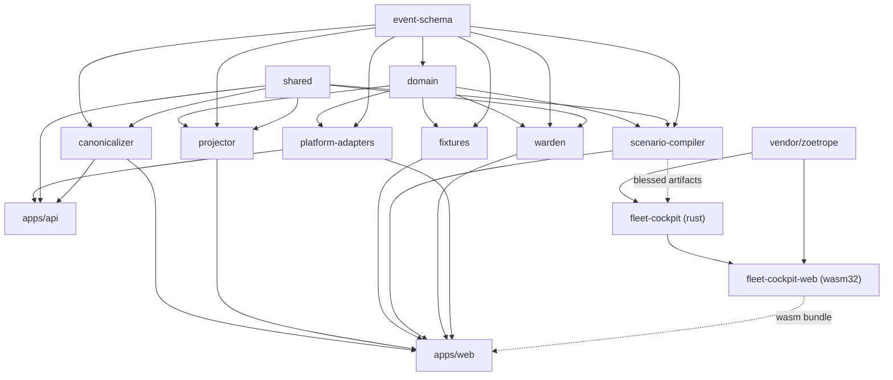

# FleetScope repository architecture

Companion to `docs/design/system.md`. That document describes the *system*; this
one describes how the *repository* enforces it.

## Package responsibilities

| Package | Owns | Must never |
|---|---|---|
| `@fleetscope/domain` | The FleetScope vocabulary: Case, Session, AgentVersion, MemoryRecord, PlatformDecision, DecisionEvidence, Intervention, ObservableCaseState | Import Astro, a server framework, or a platform SDK |
| `@fleetscope/event-schema` | The Canonical Event envelope, the closed event-type set, Source Event, JSONL codec, generated JSON Schema | Contain business behavior |
| `@fleetscope/projector` | The versioned pure reducer and the state-hash contract | Touch network, clock, filesystem, environment, or any control path |
| `@fleetscope/fixtures` | Recorded Case evidence — a product asset, not a test leftover | Import a UI component |
| `@fleetscope/canonicalizer` | The **primary redaction boundary**, dedup, and the deterministic total order | Read a clock, a network, or the filesystem; let arrival order affect the result |
| `@fleetscope/scenario-compiler` | Canonical Events → renderer transcripts **and the Render Manifest**, behind `RendererAdapter` | Write canonical evidence, leak renderer fields into the domain, or emit a prompt, reasoning, or a secret |
| `@fleetscope/warden` | Incident Detector, Policy Engine, Intervention lifecycle, the Control Adapter port | Let a detector or a model grant authority; execute one Intervention id twice |
| `@fleetscope/platform-adapters` | The seven adapter interfaces, the `recorded / synthetic / live / unavailable` mode contract, and the capability truth table | Contain a live implementation, or label a synthetic result as real |
| `@fleetscope/shared` | Canonical JSON, SHA-256, `Result`, central config parsing, the live-mode guard | Grow into a utility dumping ground |
| `@fleetscope/web` | Astro product shell: Catalog, Cases, Approvals, Cockpit mount, Audit, evidence export | Hold domain logic in a component |
| `@fleetscope/api` | Health, capability description, one bounded live proof | Serve Case data, or expose a free-form prompt |
| `fleet-cockpit` (crate) | Render Manifest, Event Cursor, scene loading over the vendored renderer, the snapshot contract | Duplicate the TypeScript domain model; report a canonical unit |
| `fleet-cockpit-web` (crate) | The browser shell, input handling, the render loop, the `fleetscope_*` ABI | Hold a rule that could have been host-tested one crate down |
| `vendor/zoetrope` | The vendored rendering substrate: fold, timeline, graph layout, camera, chips | Be edited outside a recorded, narrow patch (`vendor/VENDOR-PATCHES.md`) |

## Dependency direction



The dotted edges are artifacts, not code dependencies. The TypeScript compiler is
the sole PRODUCER of the renderer transcripts and the Render Manifest; the Rust
crates only read them, and both sides read the **same blessed bytes** under
`packages/fixtures/cases/<case>/renderer/`, so the two representations cannot
drift apart without a test failing.

`crates/fleet-cockpit` is a root workspace member and **host-testable**, because
Zoetrope's portable core (`default-features = false`) builds on the host.
`crates/fleet-cockpit-web` and `vendor/zoetrope` are `exclude`d: the first can
only be *compiled* for wasm32 (rataflow gates its ratzilla impls on
`target_arch = "wasm32"`), and the second carries its own `[workspace]` table.

Forbidden edges — a PR introducing one should be rejected:

```text
domain       → Astro / server framework
projector    → network / Gemini / clock / filesystem / Control Adapter
canonicalizer→ clock / network / filesystem
detector     → Control Adapter / model / clock
fixtures     → UI components
compiler     → canonical evidence (write direction)
renderer     → any canonical unit (caseSequence, canonical unread)
```

## Where each invariant is enforced

| # | Invariant | Enforced by |
|---|---|---|
| 1 | Case is the root correlation | Branded `CaseId`/`SessionId`; `validateCanonicalStream` rejects mixed-Case streams |
| 2 | A running Case stays bound to its Agent Version | `Case.agentVersionRef` is readonly and set at `case.created`; asserted in the fixture test |
| 3 | External input screened before context/memory/tool use | `blockedInputIds` + `checkBlockedInputUse` in the projector, AND a second check in the Scenario Compiler; both record violations rather than hiding them |
| 4 | Protected access requires independent identity authorization | Separate `AgentIdentityAdapter` and `ProtectedResourceAdapter` interfaces |
| 5 | Agent-to-agent delegation passes through Gateway | `GatewayDecision` is required before a routed edge exists |
| 6 | Every badge derives from evidence | `PlatformBadge.evidenceEventId` is non-optional; asserted in the fixture test |
| 7 | Replay projects recorded Observable Case State only | `project()` is pure; blessed prefix hashes in `expected-state.json`; ten cold runs agree (`pnpm reliability`) |
| 8 | Replay causes zero external side effects | A purity test greps the projector source (comments stripped) for forbidden APIs, AND replays every prefix of a Case containing an Intervention with a recording Control Adapter, asserting zero calls |
| 9 | Model advice never grants Runtime authority | `evaluate()` caps the disposition before advice is even read; `adviceInfluencedDisposition` is always false; an unallowlisted suggestion is rejected and the rejection recorded |
| 10 | Intervention success requires authoritative Runtime evidence | `INTERVENTION_TRANSITIONS` forbids skipping states; `Warden.execute` marks `succeeded` only on an observed `applied`; an unobservable result is `timed_out`, never success |
| 11 | Canonical unread is FleetScope's, not the renderer's | `CaseCursorState` derives it from accepted events; a test asserts the wasm snapshot carries no `caseSequence` and no `unread` |
| 12 | A cursor never uses `caseSequence / lastCaseSequence` | Every translation goes through the Render Manifest; a test asserts the ratio *demonstrably disagrees* |
| 13 | Sensitive material never reaches persistence or a renderer | Canonicalizer redacts before the Canonical Event exists; the compiler minimizes again; artifacts are scanned in both suites |
| 14 | Unknown renders as unknown, never as zero | `UnknownOr.astro`; the compiler omits `message.usage` entirely when no usage was recorded |

## Warden control loop

```text
Canonical Events → Incident Detector → [optional model adviser, untrusted]
                 → Policy Engine → Intervention → Control Adapter → Runtime
```

Implemented in `@fleetscope/warden`, with the three responsibilities deliberately
separated so none can borrow another's authority:

- the **detector** finds patterns and grants nothing. It is pure, consults no
  model, and cannot reach a Control Adapter — a test greps its source to keep it
  that way;
- the **policy engine** decides, and computes the strongest permitted disposition
  by capping downward. Written the other way round — start at `auto_act` and look
  for reasons to stop — a missing rule would fail OPEN;
- the **Warden** acts, at most once per Intervention id, and reports only what the
  Runtime said.

`proposed`, `authorized`, `requested`, `acknowledged`, and
`succeeded | failed | timed_out` are distinct and are never collapsed into one
"done". A retry is a NEW Intervention with a fresh id linked by `retryOf` — the
id is derived from `(caseId, incidentId, actionTemplate, attempt)`, so the rule
is enforced by the id scheme rather than by remembering to follow it.

`Warden.execute` reserves the id **before** calling out, so a crash between the
request and the acknowledgement cannot permit a second real request on retry.

Autonomous remediation stays deliberately narrow: the only auto-acted template is
one bounded retry of an idempotent read. An externally visible write can never
reach `auto_act`, whatever the incident's severity.
