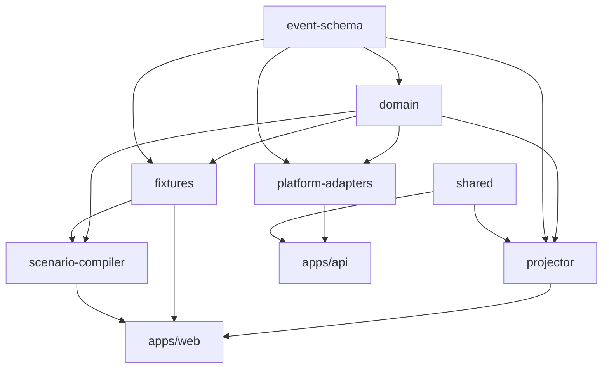

# FleetScope repository architecture

Companion to `docs/design/system.md`. That document describes the *system*; this
one describes how the *repository* enforces it.

## Package responsibilities

| Package | Owns | Must never |
|---|---|---|
| `@fleetscope/domain` | The FleetScope vocabulary: Case, Session, AgentVersion, MemoryRecord, PlatformDecision, DecisionEvidence, Intervention, ObservableCaseState | Import Astro, a server framework, or a platform SDK |
| `@fleetscope/event-schema` | The Canonical Event envelope, the closed event-type set, Source Event, JSONL codec, generated JSON Schema | Contain business behavior |
| `@fleetscope/projector` | The versioned pure reducer and the state-hash contract | Touch network, clock, filesystem, environment, or any control path |
| `@fleetscope/fixtures` | Recorded Case evidence — a product asset, not a test leftover | Import a UI component |
| `@fleetscope/scenario-compiler` | Canonical Events → Cockpit transcript, and the `RendererAdapter` seam | Write canonical evidence, or leak renderer fields into the domain |
| `@fleetscope/platform-adapters` | The seven platform adapter interfaces and the explicit `recorded / synthetic / live` mode contract | Contain a live implementation, or label a synthetic result as real |
| `@fleetscope/shared` | Canonical JSON, SHA-256, `Result`, central config parsing, the live-mode guard | Grow into a utility dumping ground |
| `@fleetscope/web` | Astro product shell: Catalog, Cases, Approvals, Cockpit mount, Audit | Hold domain logic in a component |
| `@fleetscope/api` | Health, capability description, one bounded live proof | Serve Case data, or expose a free-form prompt |
| `fleet-cockpit` (crate) | Transcript model, Event Cursor, browser ABI | Duplicate the TypeScript domain model |

## Dependency direction



Forbidden edges — a PR introducing one should be rejected:

```text
domain    → Astro / server framework
projector → network / Gemini / clock / filesystem
fixtures  → UI components
compiler  → canonical evidence (write direction)
```

## Where each invariant is enforced

| # | Invariant | Enforced by |
|---|---|---|
| 1 | Case is the root correlation | Branded `CaseId`/`SessionId`; `validateCanonicalStream` rejects mixed-Case streams |
| 2 | A running Case stays bound to its Agent Version | `Case.agentVersionRef` is readonly and set at `case.created`; asserted in the fixture test |
| 3 | External input screened before context/memory/tool use | `blockedInputIds` + `checkBlockedInputUse` in the projector; asserted in the fixture test |
| 4 | Protected access requires independent identity authorization | Separate `AgentIdentityAdapter` and `ProtectedResourceAdapter` interfaces |
| 5 | Agent-to-agent delegation passes through Gateway | `GatewayDecision` is required before a routed edge exists |
| 6 | Every badge derives from evidence | `PlatformBadge.evidenceEventId` is non-optional; asserted in the fixture test |
| 7 | Replay projects recorded Observable Case State only | `project()` is pure; blessed prefix hashes in `expected-state.json` |
| 8 | Replay causes zero external side effects | Purity test greps the projector source for forbidden APIs |
| 9 | Model advice never grants Runtime authority | `PolicyDecision` sits between advice and `Intervention`; `DecisionEvidence.modelReference` is separate from `authorization` |
| 10 | Intervention success requires authoritative Runtime evidence | `INTERVENTION_TRANSITIONS` forbids skipping states; the projector records illegal transitions |

## Warden control loop

Boundaries exist; autonomous remediation is deliberately not implemented.

```text
Canonical Events → Incident Detector → [optional model adviser]
                 → Policy Engine → Intervention → Control Adapter → Runtime
```

The model never calls the Control Adapter. `proposed`, `authorized`, `requested`,
`acknowledged`, and `succeeded | failed | timed_out` are distinct and are never
collapsed into one "done".
